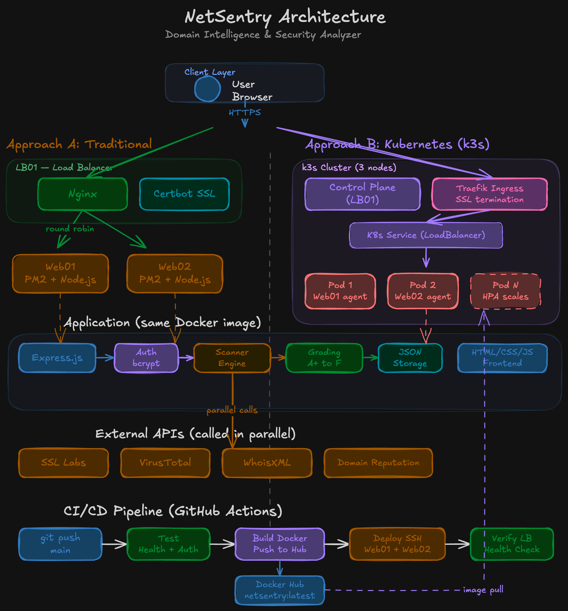

# NetSentry — Real-Time Domain Intelligence & Security Analyzer


**NetSentry** is a web application that performs comprehensive security analysis on any domain. Enter a domain name and instantly receive an aggregated security report covering SSL/TLS certificates, threat detection, domain reputation, security headers, WHOIS intelligence, and performance metrics — all synthesized into a single actionable letter grade (A+ to F).

**Live Demo:** [https://netsentry.iraelie.tech](https://netsentry.iraelie.tech)

**Demo Video:** [Watch on YouTube (2 min)](https://youtu.be/xH0T4s4YcqM)

**Architecture Diagram:** [View on Excalidraw](https://excalidraw.com/#json=vF1Z76RrBpZW6Iwq7clur,6efzM2lU1b2018jG5YevwQ)



---

## Table of Contents

- [Features](#features)
- [APIs Used](#apis-used)
- [Tech Stack](#tech-stack)
- [Project Structure](#project-structure)
- [Local Setup](#local-setup)
- [Docker Setup](#docker-setup)
- [Deployment to Web Servers](#deployment-to-web-servers)
- [Load Balancer Configuration](#load-balancer-configuration)
- [SSL Certificate Setup](#ssl-certificate-setup)
- [Kubernetes Deployment](#kubernetes-deployment)
- [CI/CD Pipeline](#cicd-pipeline)
- [Authentication System](#authentication-system)
- [Testing](#testing)
- [Challenges & Solutions](#challenges--solutions)
- [Demo Video Outline](#demo-video-outline)
- [Credits](#credits)

---

## Features

### Core
- **Domain Scanner** — Enter any domain and get a full security audit in seconds.
- **SSL/TLS Analysis** — Certificate validity, issuer, expiry, protocol support, and grade via SSL Labs.
- **Threat Detection** — Malware, phishing, and blacklist scanning across 70+ vendors via VirusTotal.
- **Domain Reputation** — Safety score (0-100) and threat category analysis via WhoisXML Domain Reputation API.
- **WHOIS Intelligence** — Domain age, registrar, expiry date, nameservers, DNSSEC status via WhoisXML.
- **Security Headers Audit** — Checks for HSTS, CSP, X-Frame-Options, X-Content-Type-Options, Referrer-Policy, Permissions-Policy, and more (built-in, no API needed).
- **Performance Metrics** — DNS lookup time, total response time, redirect chains, compression detection (built-in).
- **Overall Security Grade** — Custom weighted grading algorithm (A+ to F) across all 6 categories.

### Authentication & Authorization (Bonus)
- User registration with input validation (username format, password length).
- Secure login with bcrypt password hashing (10 salt rounds).
- Cookie-based sessions with httpOnly, sameSite, and secure flags.
- Protected routes — all scan, history, and compare endpoints require authentication.
- Per-user scan history — users only see their own scans, enforced server-side.
- Auto-redirect to login screen when sessions expire.
- Logout with full session destruction and cookie clearing.

### User Interaction
- Filter findings by severity (Critical / Warning / Info).
- Filter by category (SSL, Threats, Reputation, Headers, WHOIS, Performance).
- Sort results by severity or category.
- Search scan history by domain name.
- Filter history by grade.
- Paginated history view.
- Side-by-side domain comparison with winner declaration.
- Delete past scans from history.

### Error Handling
- Graceful fallback when APIs are unavailable (partial results still shown).
- Input validation and domain sanitization.
- Rate limiting to prevent abuse (50 requests per 15 minutes).
- Timeout handling for slow API responses.
- TLS fallback when SSL Labs is slow (uses Node.js TLS module directly).

### DevOps (Bonus)
- **Dockerized** — Multi-stage Dockerfile with Alpine Linux, non-root user, and built-in health check.
- **Docker Compose** — Full production simulation (2 app instances + Nginx load balancer) in one command.
- **Kubernetes** — Full manifest set: Namespace, Deployment (2 replicas), Service (LoadBalancer), Secrets, and HPA (auto-scales 2 to 6 pods).
- **CI/CD Pipeline** — GitHub Actions with 3 stages: Test, Build & Push Docker Image, Deploy to servers.
- **Automated deployment** — SSH-based deploy to Web01 and Web02 with post-deploy health verification.
- **SSL Termination** — Let's Encrypt certificate via Certbot on the load balancer.
- **Production health endpoint** — Returns server hostname, memory usage, Node version, PID, and uptime.

---

## APIs Used

| API | Purpose | Auth | Free Tier | Docs |
|-----|---------|------|-----------|------|
| [SSL Labs API](https://www.ssllabs.com/projects/ssllabs-apis/) (Qualys) | SSL/TLS certificate and configuration analysis | No key needed | Unlimited | [Docs](https://github.com/ssllabs/ssllabs-scan/blob/master/ssllabs-api-docs-v3.md) |
| [VirusTotal API](https://www.virustotal.com/) | Malware, phishing and blacklist scanning | API key required | 500 req/day | [Docs](https://developers.virustotal.com/reference/overview) |
| [WhoisXML WHOIS API](https://whoisxmlapi.com/) | Domain WHOIS registration data | API key required | 500 req/month | [Docs](https://whoisxmlapi.com/documentation) |
| [WhoisXML Domain Reputation API](https://domain-reputation.whoisxmlapi.com/) | Domain safety score and threat categories | Same key as WHOIS | 500 req/month | [Docs](https://domain-reputation.whoisxmlapi.com/api/documentation) |

Security headers audit and performance checks are implemented directly in the application without external APIs, ensuring the app provides value even if APIs are unavailable.

---

## Tech Stack

| Layer | Technology |
|-------|-----------|
| Backend | Node.js v22 + Express.js |
| Frontend | HTML + CSS + Vanilla JavaScript |
| Database | JSON file storage (zero dependencies) + Redis |
| Security | Helmet.js, express-rate-limit, CORS |
| Authentication | bcryptjs (password hashing), express-session (cookie sessions) |
| Containerization | Docker (multi-stage Alpine build), Docker Compose |
| Orchestration | Kubernetes (Deployment, Service, HPA autoscaler) |
| CI/CD | GitHub Actions (test, build, push to Docker Hub, deploy) |
| Process Manager | PM2 |
| Load Balancer | Nginx (round-robin) |
| SSL | Let's Encrypt via Certbot |

---

## Project Structure

```
netsentry/
├── .github/workflows/
│   └── integrate-deploy.yml  # CI/CD pipeline
├── config/
│   └── index.js              # Centralized configuration
├── database/
│   └── db.js                 # JSON file storage (users + scans)
├── k8s/                      # Kubernetes manifests
│   ├── namespace.yml
│   ├── secret.yml
│   ├── deployment.yml
│   ├── service.yml
│   └── hpa.yml
├── middleware/
│   ├── auth.js               # requireAuth middleware
│   └── errorHandler.js       # 404 + global error handler
├── frontend/
│   ├── style.css
│   ├── js/
│   │   ├── app.js            # Initialization + tab navigation
│   │   ├── auth.js           # Login/register/logout UI
│   │   ├── compare.js        # Side-by-side comparison
│   │   ├── history.js        # Scan history with search/filter
│   │   ├── scanner.js        # Domain scanning + results
│   │   └── utils.js          # API helper, DOM utils, formatters
│   └── index.html            # Single-page application
├── routes/
│   ├── auth.js               # Register, login, logout, me
│   ├── scan.js               # Run scan, get scan by ID
│   ├── history.js            # List/delete scan history
│   └── compare.js            # Compare two domains
├── services/
│   ├── sslLabs.js            # SSL Labs API
│   ├── virusTotal.js         # VirusTotal API
│   ├── whoisLookup.js        # WhoisXML WHOIS API
│   ├── domainReputation.js   # WhoisXML Reputation API
│   ├── headersAudit.js       # Security headers checker
│   ├── performanceCheck.js   # Response time and DNS
│   └── grading.js            # Weighted A+ to F scoring
├── utils/
│   └── validators.js         # Domain sanitization
├── .dockerignore
├── .env.example
├── .gitignore
├── docker-compose.yml
├── Dockerfile
├── package-lock.json
├── package.json
├── server.js
└── README.md
```

---

## Local Setup

### Prerequisites
- Node.js v18 or higher
- npm (comes with Node.js)

### Steps

1. **Clone the repository:**
   ```bash
   git clone https://github.com/n-elie7/netsentry.git
   cd netsentry
   ```

2. **Install dependencies:**
   ```bash
   npm install
   ```

3. **Configure environment variables:**
   ```bash
   cp .env.example .env
   ```
   Edit `.env` and add your API keys:
   ```
   VIRUSTOTAL_API_KEY=your_key_here
   WHOISXML_API_KEY=your_key_here
   SESSION_SECRET=any_random_string_here
   ```

4. **Start the application:**
   ```bash
   npm start
   ```

5. **Open in browser:** `http://localhost:3000`

6. Create an account on the login screen, then start scanning domains.

---

## Docker Setup

### Single container

```bash
docker build -t netsentry .

docker run -d --name netsentry -p 3000:3000 \
  -e VIRUSTOTAL_API_KEY=your_key \
  -e WHOISXML_API_KEY=your_key \
  -e SESSION_SECRET=your_secret \
  -e NODE_ENV=production \
  netsentry
```

### Docker Compose (full production simulation)

```bash
cp .env.example .env && nano .env
docker-compose up --build
# Access at http://localhost
```

Runs two app instances (web01, web02) and one Nginx load balancer (lb01) with round-robin.

---

## Deployment to Web Servers

### Architecture

```
Users --> https://netsentry.iraelie.tech
               |
          [LB01 - Nginx + SSL]
               |
        +-----------+
     [Web01]     [Web02]
     PM2+Node    PM2+Node
```

The CI/CD pipeline deploys automatically on push to main. For manual deployment:

```bash
ssh user@web_server_ip
cd /var/www/netsentry
git pull origin main
npm ci --omit=dev
pm2 stop netsentry 2>/dev/null || true
pm2 delete netsentry 2>/dev/null || true
pm2 start server.js --name netsentry
curl -sf http://localhost:3000/api/health
```

---

## Load Balancer Configuration

Nginx config on LB01 (`/etc/nginx/sites-available/netsentry`):

```nginx
upstream netsentry_backend {
    server WEB01_IP:3000;
    server WEB02_IP:3000;
}

server {
    server_name netsentry.iraelie.tech;

    location / {
        proxy_pass http://netsentry_backend;
        proxy_http_version 1.1;
        proxy_set_header Host $host;
        proxy_set_header X-Real-IP $remote_addr;
        proxy_set_header X-Forwarded-For $proxy_add_x_forwarded_for;
        proxy_set_header X-Forwarded-Proto $scheme;
        proxy_set_header Upgrade $http_upgrade;
        proxy_set_header Connection 'upgrade';
        proxy_cache_bypass $http_upgrade;
    }
}
```

```bash
sudo ln -sf /etc/nginx/sites-available/netsentry /etc/nginx/sites-enabled/
sudo rm -f /etc/nginx/sites-enabled/default
sudo nginx -t && sudo systemctl restart nginx
```

### Verify round-robin

```bash
for i in {1..4}; do
  curl -sI https://netsentry.iraelie.tech/api/health | grep X-Served-By
done
```

The hostname alternates between web01 and web02.

---

## SSL Certificate Setup

SSL termination at the load balancer using Let's Encrypt:

```bash
sudo apt install -y certbot python3-certbot-nginx
sudo certbot --nginx -d netsentry.iraelie.tech
```

Choose option 2 to redirect HTTP to HTTPS. Certbot handles certificate generation, Nginx configuration, and auto-renewal (every 90 days).

---

## Kubernetes Deployment

Kubernetes manifests in `k8s/` directory. Tested with minikube for local development.

| Assignment Component | Kubernetes Equivalent |
|---|---|
| Web01 + Web02 | Deployment with replicas: 2 |
| Lb01 (Nginx) | Service type LoadBalancer |
| Manual restart | Liveness + readiness probes |
| Fixed 2 servers | HPA auto-scales 2 to 6 pods |

```bash
minikube start
kubectl apply -f k8s/namespace.yml
kubectl apply -f k8s/secret.yml
kubectl apply -f k8s/deployment.yml
kubectl apply -f k8s/service.yml
kubectl apply -f k8s/hpa.yml
kubectl get all -n netsentry
minikube service netsentry -n netsentry
```

---

## CI/CD Pipeline

GitHub Actions: `.github/workflows/integrate-deploy.yml`

**Stage 1 — Test:** Installs deps, syntax checks, verifies all modules load, health check, auth protection check.

**Stage 2 — Build & Push:** Builds Docker image, verifies container health, pushes to Docker Hub with SHA and latest tags.

**Stage 3 — Deploy:** SSHs into Web01 and Web02 (pulls code, installs deps, restarts PM2, health check), then verifies LB01.

### GitHub Secrets

| Secret | Description |
|--------|-------------|
| `WEB01_HOST` | Web Server 01 IP |
| `WEB02_HOST` | Web Server 02 IP |
| `LB01_HOST` | Load Balancer IP |
| `SSH_USERNAME` | SSH username |
| `SSH_PRIVATE_KEY` | SSH private key |
| `SSH_PASSPHRASE` | SSH key passphrase |
| `DOCKERHUB_USERNAME` | Docker Hub username |
| `DOCKERHUB_TOKEN` | Docker Hub token |

---

## Authentication System

Cookie-based sessions with bcrypt password hashing.

| Method | Endpoint | Description | Auth |
|--------|----------|-------------|------|
| POST | /api/auth/register | Create account | No |
| POST | /api/auth/login | Log in | No |
| POST | /api/auth/logout | Log out | Yes |
| GET | /api/auth/me | Current user | Yes |
| POST | /api/scan | Run scan | Yes |
| GET | /api/scan/:id | Get scan | Yes |
| GET | /api/history | List history | Yes |
| DELETE | /api/history/:id | Delete scan | Yes |
| POST | /api/compare | Compare domains | Yes |
| GET | /api/health | Health check | No |

---

## Testing

1. Health check: `GET /api/health` returns hostname, memory, uptime
2. Register and login on the auth screen
3. Scan `github.com` — verify 6 categories return results
4. Check the grade card, breakdown bars, and findings
5. Filter by severity and category
6. Sort by severity or category
7. History tab: search by domain, filter by grade
8. Compare two domains side by side
9. Enter invalid domain — verify error message
10. Access `https://netsentry.iraelie.tech` — check X-Served-By alternates

---

## Challenges & Solutions

| Challenge | Solution |
|-----------|----------|
| SSL Labs API takes minutes for fresh scans | Used fromCache=on plus Node.js TLS fallback |
| VirusTotal rate limits (500 req/day) | Graceful degradation with partial results |
| Domain Reputation warnings showing [object Object] | Extracted warningDescription field from objects |
| npm ci EACCES permission errors on servers | Fixed with chown before npm install |
| PM2 process not found on first deploy | Stop/delete with error suppression then start |
| Nginx 404 on LB health check | Added Host header to curl command |
| Nginx 301 on health check | Certbot redirect — used curl -L -k https |
| Let's Encrypt cert failing | Port 80 blocked by AWS Security Group |
| Ubuntu ships Node.js v10 | NodeSource repo for Node.js v22 |
| k3s consuming all server resources | Servers too small — switched to minikube |
| Domain input variations | Sanitization function stripping protocols, paths, ports |

---

## Credits

### APIs
- [SSL Labs](https://www.ssllabs.com/) by Qualys
- [VirusTotal](https://www.virustotal.com/)
- [WhoisXML API](https://whoisxmlapi.com/)

### Libraries
- [Express.js](https://expressjs.com/), [bcryptjs](https://github.com/dcodeIO/bcrypt.js), [express-session](https://github.com/expressjs/session), [Helmet.js](https://helmetjs.github.io/), [Axios](https://axios-http.com/)

### Tools
- [PM2](https://pm2.keymetrics.io/), [Nginx](https://nginx.org/), [Let's Encrypt](https://letsencrypt.org/), [Docker](https://www.docker.com/), [GitHub Actions](https://github.com/features/actions), [Kubernetes](https://kubernetes.io/), [Minikube](https://minikube.sigs.k8s.io/docs/start/)

### Fonts
- [Outfit](https://fonts.google.com/specimen/Outfit), [JetBrains Mono](https://www.jetbrains.com/lp/mono/)

